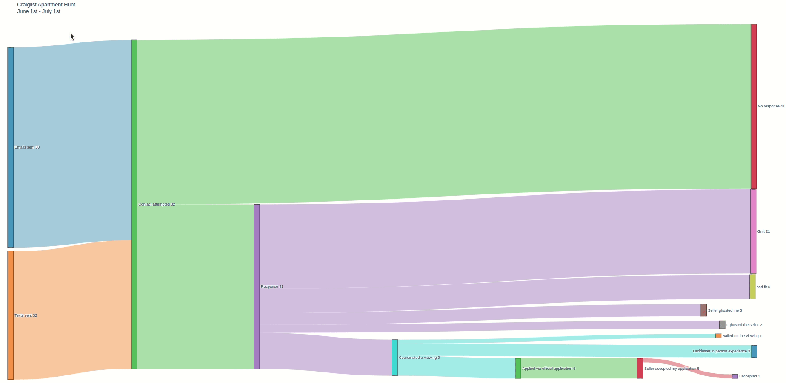
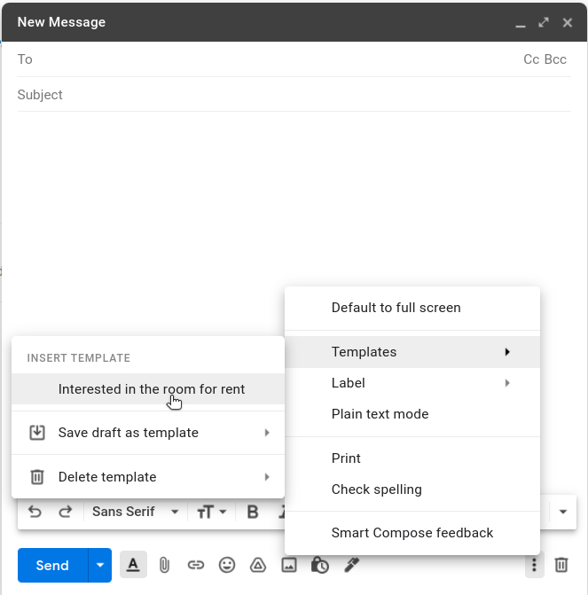

[](https://pypi.python.org/pypi/azure-devops)
[](https://pypi.python.org/pypi/azure-devops)

# 🏘️ [craiglist-apartment](https://onescriptkid.github.io/craiglist-apartment/)

A quick and dirty diagram for my experience chasing down aparments on Craigslist



🚀 Protips to reduce pain:
- Enable email templates in [gmail](https://support.google.com/a/users/answer/9308990?hl=en) and madlib with the `email-template`
- Add *saved searches* to automatically receive listings via email notifications as they're posted.
- Avoid grifts by not clicking links and *always* seeing the listing IRL.

## #️ Filters

- Max Price $1600
- has image
- posted today
- bundle duplicates
- lat/lng search via circular map selection

## 🤖 [Email Template](https://support.google.com/a/users/answer/9308990?hl=en) 

Cold-call sellers with my [`email-template`](./email-template).
Select craigslist listings under categories ...

- rooms & shares
- apartments / housing for rent
- sublets & temporary

<br>



*email-template*
<br>

```
I'm a <career> looking for a move-in date of <early|mid|late> <month> and am interested in checking out the rental unit. If that sounds good to you, I'm ready to move forward with the process.


Is there a good time for me to see the place in person? If so, what's the address?


I live in the area with a flexible work schedule so anytime works for me, but weekends and after <time> on weekdays is preferable.


Send an email or text if there's anything more you want to know about me.


<FirstName LastInitial>


Phone #: <phone #>

Email: <email>
```

## 🔥 Quickstart

```bash
virtualenv -p python3 ./venv
pip install -r requirements.txt
python sankey.py
```

## 🧹Formatting and linting
```
black sankey.py
flake8 sankey.py
```